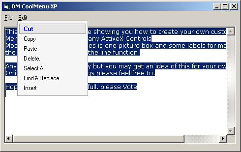



## DM MenuXP

### Description

Hi All well I am back agian. mesing around with the line function. anyway this Time I sort of made a custom menu. you know like them DHTML sort of things. anyway still some bugs in it. but no bad for an hours work of codeing.

well if I get some time I put this into an Usercontrol next time for you and add some more features. anyway hope you like it.
 
### More Info
 

             |
---                |---
**Submitted On**   |2005-02-17 21:50:02
**By**             |[dreamvb](https://github.com/Planet-Source-Code/PSCIndex/blob/master/ByAuthor/dreamvb.md)
**Level**          |Beginner
**User Rating**    |5.0 (10 globes from 2 users)
**Compatibility**  |VB 4\.0 \(16\-bit\), VB 4\.0 \(32\-bit\), VB 5\.0, VB 6\.0
**Category**       |[Coding Standards](https://github.com/Planet-Source-Code/PSCIndex/blob/master/ByCategory/coding-standards__1-43.md)
**World**          |[Visual Basic](https://github.com/Planet-Source-Code/PSCIndex/blob/master/ByWorld/visual-basic.md)
**Archive File**   |[DM\_MenuXP1854152172005\.zip](https://github.com/Planet-Source-Code/dreamvb-dm-menuxp__1-58976/archive/master.zip)

